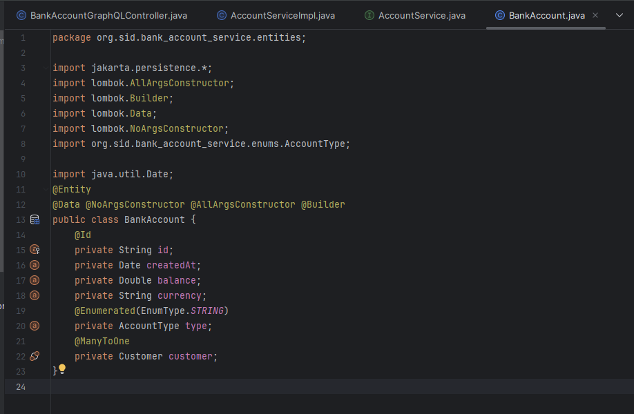
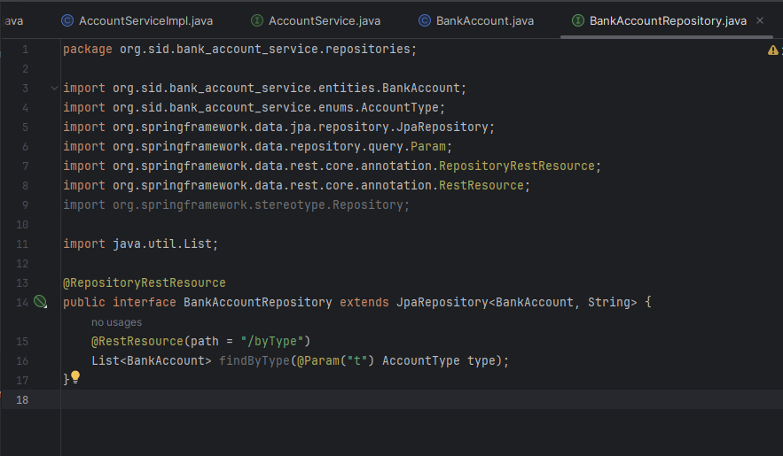
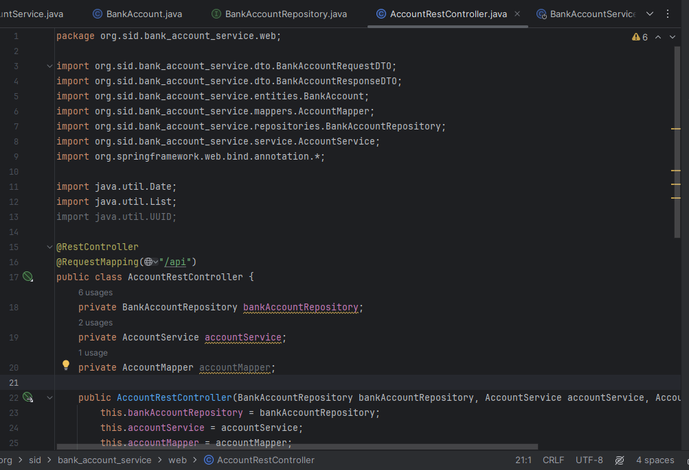
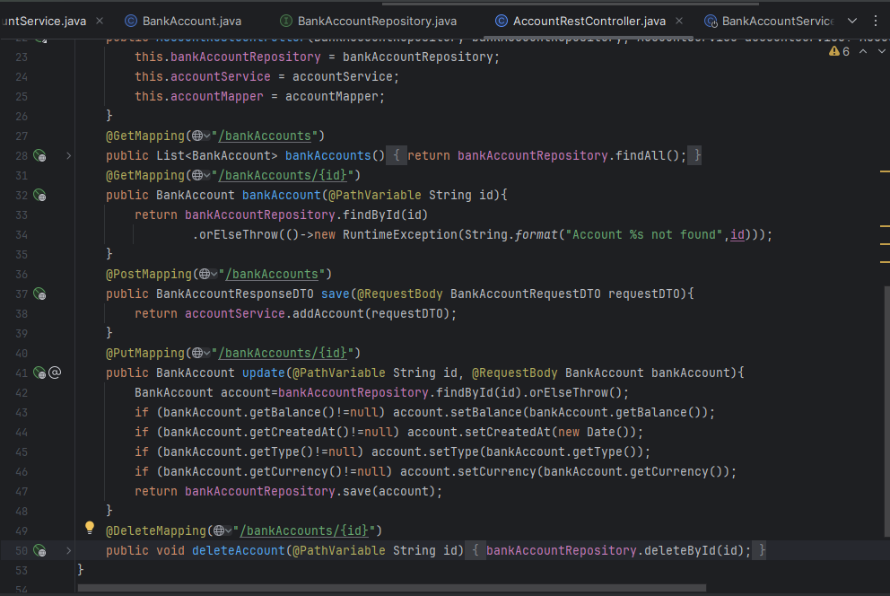
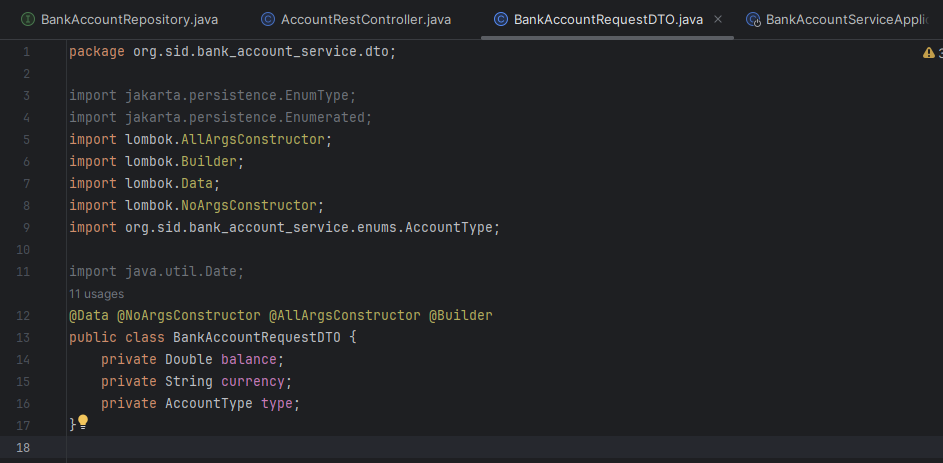
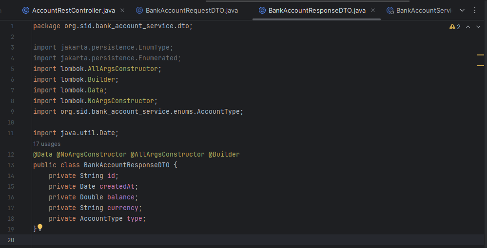
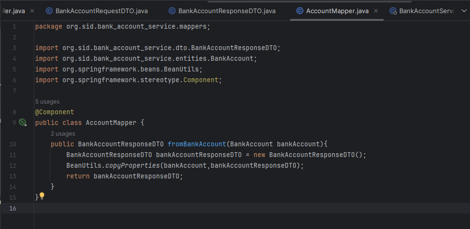
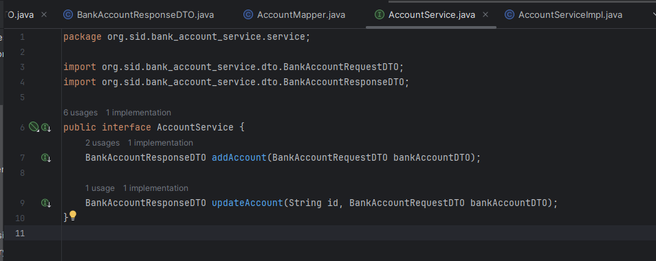
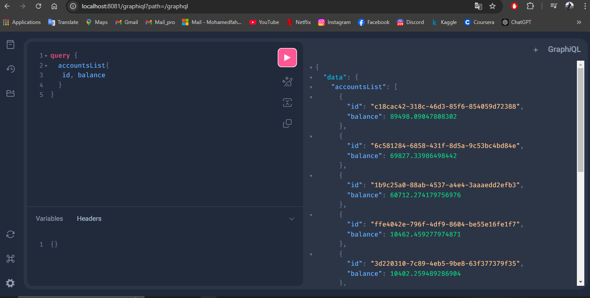

<h1>Compte Rendu</h1>
 
<h2>Creation de l'entité JPA BankAccount :</h2>

 
<h2>Creation de l'interface BankAccountRepository :</h2>

 
<h2>Creation du Web Service Restfull qui permet de gérer des comptes :</h2>

 
<h2>Creation des DTOs :</h2>

 
<h2>Creation des Mappers :</h2>

 
<h2>Creation de la couche Métier :</h2>

 
<h2>Partie GraphiQL :</h2>

